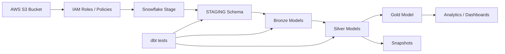
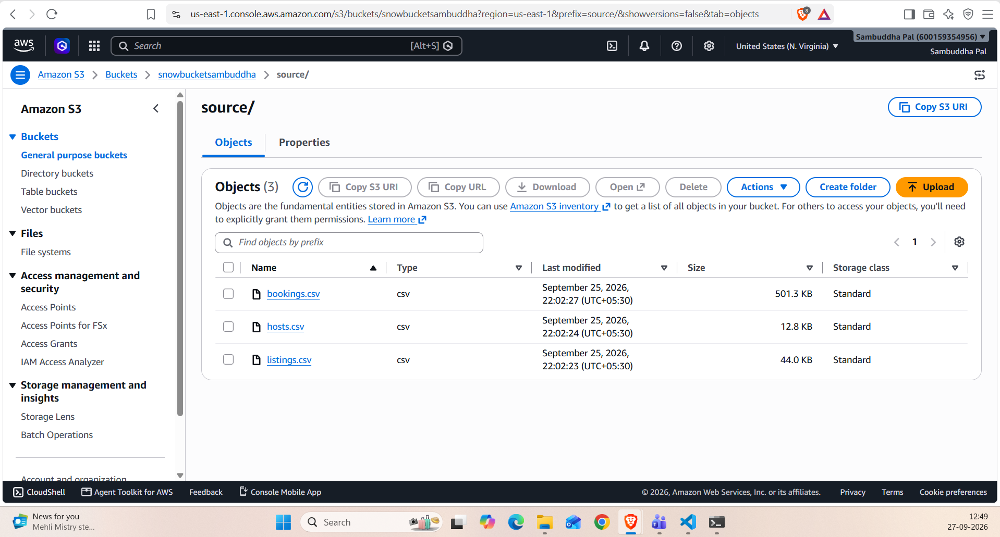
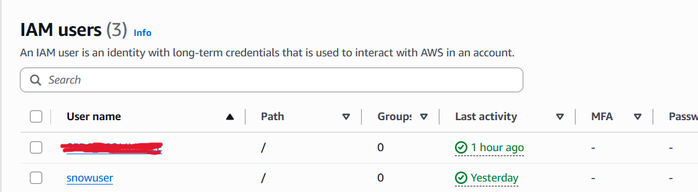
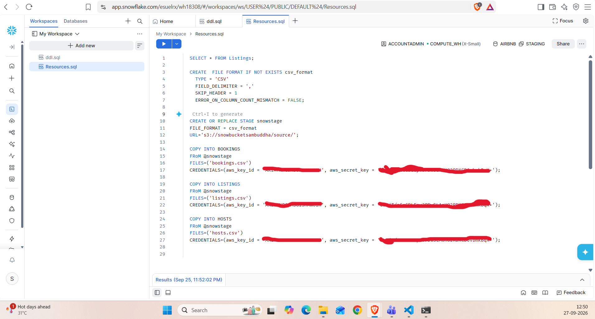
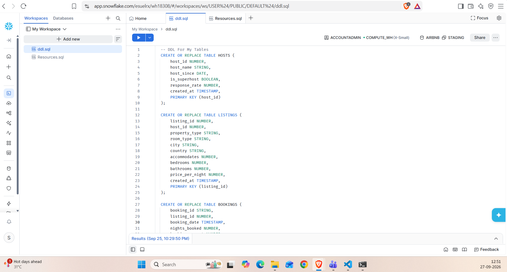
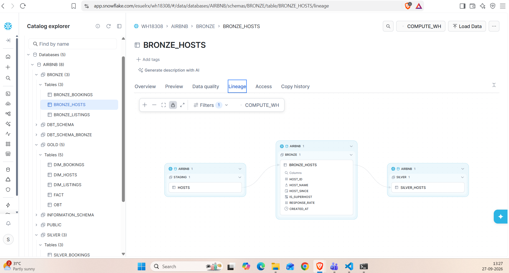
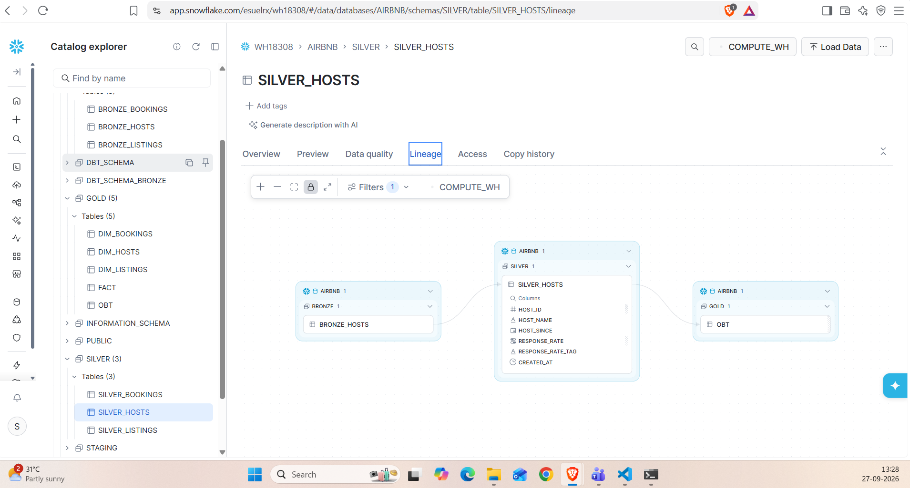
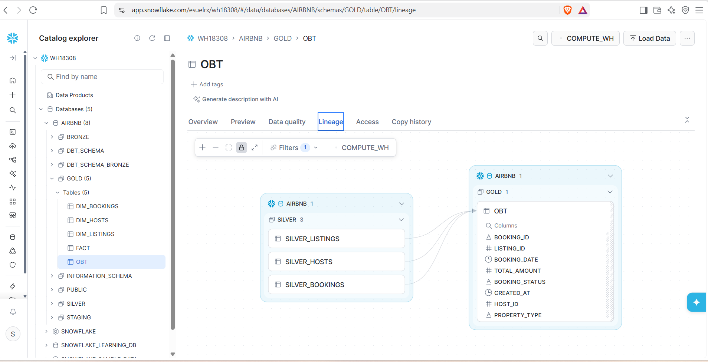
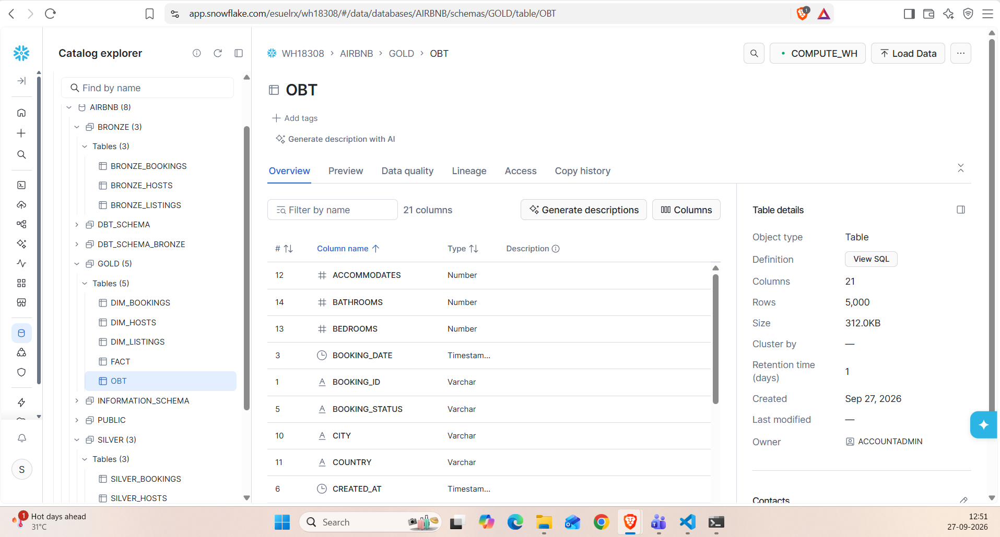

# Snowflake dbt Project

A dbt project for Snowflake that transforms Airbnb-style source data into a clean analytics model using a layered ELT approach. This project demonstrates bronze, silver, and gold transformations, incremental loading, Jinja macros, snapshot-based historical tracking, and source testing.

## Overview

This project is designed to take raw data from AWS S3 and other upstream sources, load it into Snowflake, and build a reporting-ready analytical layer using dbt. It follows a typical medallion architecture:

- Bronze: ingest and lightly structure raw data
- Silver: clean, enrich, and standardize records
- Gold: build an analytical table for reporting and dashboard use
- Snapshots: track historical changes for dimension-like entities

The end-to-end architecture is built around the following flow:

AWS S3 -> IAM permissions -> Snowflake external/internal stages -> STAGING schema -> Bronze models -> Silver models -> Gold model -> Reporting layer

The project uses:
- dbt
- Snowflake
- AWS S3 and IAM-based access patterns
- Jinja macros
- Incremental models
- Snapshot tracking
- dbt tests

---

## End-to-End Architecture



### Data flow narrative

1. Raw files are stored in AWS S3.
2. IAM permissions allow Snowflake to access those files in a secure and controlled way.
3. Snowflake creates a stage and loads the data into a `STAGING` schema.
4. The dbt project reads from the staging layer and builds bronze tables.
5. Bronze data is transformed into silver-layer standard models.
6. The gold layer assembles the final business-ready dataset.
7. Snapshots maintain historical tracking for slowly changing dimension logic.

---

## Architecture in Practice

The project follows a structured pipeline from cloud storage to warehouse transformation:

```text
AWS S3
   ↓
IAM Permissions / Roles
   ↓
Snowflake Stage
   ↓
STAGING Schema
   ↓
Bronze Models
   ↓
Silver Models
   ↓
Gold Model (OBT)
   ↓
Visualization / Reporting Layer
```

This model is useful when working with semi-structured or external datasets that need to be staged securely before transformation.

---

## Project Structure

```text
aws_dbt_snowflake_proj/
├── analyses/
├── macros/
│   ├── generate_schema_name.sql
│   ├── multiply.sql
│   ├── tag.sql
│   └── trimmer.sql
├── models/
│   ├── bronze/
│   │   ├── bronze_bookings.sql
│   │   ├── bronze_hosts.sql
│   │   └── bronze_listings.sql
│   ├── gold/
│   │   └── obt.sql
│   ├── silver/
│   │   ├── silver_bookings.sql
│   │   ├── silver_hosts.sql
│   │   └── silver_listings.sql
│   ├── properties.yml
│   └── sources/
│       └── sources.yml
├── snapshots/
│   ├── dim_bookings.yml
│   ├── dim_hosts.yml
│   └── dim_listings.yml
├── tests/
│   └── source_tests.sql
├── dbt_project.yml
├── profiles.yml
├── README.md
├── .gitignore
├── .user.yml
├── logs/
├── seeds/
├── target/
├── dbt_packages/
└── .gitignore
```

---

## Source Data

The project reads from Snowflake staging tables:

- Database: `AIRBNB`
- Schema: `STAGING`
- Tables:
  - `listings`
  - `bookings`
  - `hosts`

These sources are declared in `models/sources/sources.yml`.

Example source configuration:

```yaml
sources:
  - name: STAGING
    database: AIRBNB
    schema: STAGING
    tables:
      - name: listings
      - name: bookings
      - name: hosts
```

---

## Layered Data Model

### Bronze Layer

The bronze models bring staging data into a cleaner dbt-managed structure.

Files:
- `models/bronze/bronze_bookings.sql`
- `models/bronze/bronze_hosts.sql`
- `models/bronze/bronze_listings.sql`

These models are configured as incremental tables, allowing repeated runs to process only new or changed records.

Example pattern:

```sql
{{ config(materialized='incremental') }}

SELECT * FROM {{ source('STAGING', 'bookings') }}


WHERE CREATED_AT > (SELECT COALESCE(MAX(CREATED_AT), '1900-01-01') FROM {{ this }})

```

### Silver Layer

The silver layer adds transformations and business logic.

#### `silver_bookings.sql`
This model builds the booking dataset and uses `BOOKING_ID` as the unique key.

```sql
{{ config(materialized='incremental',
   unique_key='BOOKING_ID'
)}}

SELECT 
    BOOKING_ID,
    LISTING_ID,
    BOOKING_DATE,
    {{ multiply('NIGHTS_BOOKED','BOOKING_AMOUNT', 2) }} + CLEANING_FEE + SERVICE_FEE AS TOTAL_AMOUNT,
    BOOKING_STATUS,
    CREATED_AT
FROM {{ ref('bronze_bookings') }}
```

#### `silver_hosts.sql`
This model cleans the host records, fixes formatting, and assigns rating labels such as:
- Very Good
- Good
- Average
- Poor

#### `silver_listings.sql`
This model standardizes listing attributes and adds a price tier label using the `tag` macro.

### Gold Layer

#### `models/gold/obt.sql`
The gold layer creates a One Big Table (OBT) joining the key silver models:

- `silver_bookings`
- `silver_listings`
- `silver_hosts`

This produces one wide analytical table for dashboards and downstream reporting.

Example structure:

```sql
{% set configs=[
    {
        "table": "AIRBNB.SILVER.SILVER_BOOKINGS",
        "columns":"SILVER_bookings.*",
        "alias":"SILVER_bookings",
    },
    {
        "table":"AIRBNB.SILVER.SILVER_listings",
        "columns":"SILVER_listings.HOST_ID, SILVER_listings.PROPERTY_TYPE, SILVER_listings.ROOM_TYPE, SILVER_listings.CITY, SILVER_listings.COUNTRY, SILVER_listings.ACCOMMODATES, SILVER_listings.BEDROOMS, SILVER_listings.BATHROOMS, SILVER_listings.PRICE_PER_NIGHT, silver_listings.PRICE_PER_NIGHT_TAG, silver_listings.CREATED_AT AS LISTINGS_CREATED_AT",
        "alias":"SILVER_listings",
        "join_condition":"SILVER_bookings.LISTING_ID = SILVER_listings.LISTING_ID"
    },
    {
        "table":"AIRBNB.SILVER.SILVER_hosts",
        "columns":"SILVER_hosts.HOST_NAME, SILVER_hosts.HOST_SINCE, silver_hosts.RESPONSE_RATE_TAG, SILVER_hosts.CREATED_AT AS HOSTS_CREATED_AT",
        "alias":"SILVER_hosts",
        "join_condition":"SILVER_listings.HOST_ID = SILVER_hosts.HOST_ID"
    }
]
%}

SELECT
    
        {{ config['columns'] }},
    
FROM
    
    
        {{ config['table']}} AS {{ config['alias'] }}
    
       LEFT JOIN {{ config['table']}} AS {{ config['alias'] }} ON {{ config['join_condition'] }}
    
    
```

---

## Snapshots and Historical Tracking

The project includes historical snapshot definitions for dimension-like data:

- `snapshots/dim_bookings.yml`
- `snapshots/dim_hosts.yml`
- `snapshots/dim_listings.yml`

These snapshots use timestamp-based tracking and maintain a historical record for slowly changing dimension data. In practice, they let the model capture changes across time instead of overwriting prior values. This is useful when you need to preserve the state of a booking, host, or listing as of a given point in time.

Snapshot pattern used in this project:

```yaml
snapshots:
  - name: dim_bookings
    relation: ref('bookings')
    config:
      schema: gold
      database: AIRBNB
      unique_key: BOOKING_ID
      strategy: timestamp
      updated_at: CREATED_AT
      dbt_valid_to_current: "to_date('9999-12-31')"
```

This pattern supports SCD-style historical analysis where a record can be tracked across multiple versions as updates occur.

### Why snapshots matter here

- preserve historical state of business entities
- support trend analysis over time
- enable auditability for changed records
- help with dimensional reporting and historical comparisons

---

## Gold Layer and Ephemeral Models

The gold layer is implemented as a finalized analytics layer designed to support downstream reporting and dashboard consumption. In this project, the gold folder contains an `obt.sql` model that joins the main silver tables and creates a single analytics table.

The project also includes the concept of an ephemeral model in the gold layer configuration:

```yaml
models:
  aws_dbt_snowflake_proj:
    gold:
      +materialized: table
      +schema: gold
      ephemeral:
        +materialized: ephemeral
```

### What this means

- `gold` models are treated as final reporting tables
- `ephemeral` models can be used as intermediate, non-materialized transforms that are inlined into parent models
- this reduces unnecessary physical objects while still keeping the pipeline modular and readable

### Why it is useful

- keeps the warehouse cleaner
- avoids duplicate intermediate tables
- helps build reusable transformation logic without cluttering the database
- makes the final gold model more maintainable and efficient

---

## Metadata-Driven Pipeline Design

This project implements metadata-driven transformation logic directly in the gold-layer model `models/gold/obt.sql`. Instead of hardcoding a single fixed join pattern, the model defines a `configs` list that contains metadata for each table to be joined, including:

- table name
- selected columns
- alias
- join condition

The dbt Jinja loop then reads this metadata and dynamically generates the SQL for the final join logic.

### Actual pattern implemented in `obt.sql`

```sql
{% set configs=[
    {
        "table": "AIRBNB.SILVER.SILVER_BOOKINGS",
        "columns":"SILVER_bookings.*",
        "alias":"SILVER_bookings",
    },
    {
        "table":"AIRBNB.SILVER.SILVER_listings",
        "columns":"SILVER_listings.HOST_ID, SILVER_listings.PROPERTY_TYPE, SILVER_listings.ROOM_TYPE, SILVER_listings.CITY, SILVER_listings.COUNTRY, SILVER_listings.ACCOMMODATES, SILVER_listings.BEDROOMS, SILVER_listings.BATHROOMS, SILVER_listings.PRICE_PER_NIGHT,silver_listings.PRICE_PER_NIGHT_TAG, silver_listings.CREATED_AT AS LISTINGS_CREATED_AT",
        "alias":"SILVER_listings",
        "join_condition":"SILVER_bookings.LISTING_ID = SILVER_listings.LISTING_ID"
    },
    {
        "table":"AIRBNB.SILVER.SILVER_hosts",
        "columns":"SILVER_hosts.HOST_NAME, SILVER_hosts.HOST_SINCE,silver_hosts.RESPONSE_RATE_TAG, SILVER_hosts.CREATED_AT AS HOSTS_CREATED_AT",
        "alias":"SILVER_hosts",
        "join_condition":"SILVER_listings.HOST_ID = SILVER_hosts.HOST_ID"
    }
]
%}
```

This is a real metadata-driven pattern because the table relationships and selected columns are declared as structured data and then consumed by the Jinja loop to compose the final SQL.

### Why this is important

- scalable for new tables without rewriting the query manually
- easier to maintain and extend
- consistent design across the warehouse
- supports reusable, parameterized transformation patterns
- makes the project behave like a dynamic pipeline driven by metadata rather than static hardcoded SQL

### In this repo specifically

- `sources.yml` defines the source metadata
- `obt.sql` defines the join metadata for the final gold table
- Jinja iterates over the metadata to build the query dynamically
- this pattern is a practical implementation of metadata-driven data engineering

---

## Macros

The project contains reusable Jinja macros for common SQL logic.

### `generate_schema_name.sql`
Customizes the schema naming process.

```sql


    
    

        {{ default_schema }}

    

        {{ custom_schema_name | trim }}

    


```

### `multiply.sql`
Multiplies two values and rounds them to a chosen precision.

```sql

    ROUND({{x}} * {{y}}, {{precision}})

```

### `tag.sql`
Creates conditional categorization logic.

```sql

   CASE
    WHEN {{ col }} < 100 THEN 'LOW'
    WHEN {{ col }} >= 100 AND {{ col }} < 200 THEN 'MEDIUM'
    ELSE 'HIGH'
    END

```

### `trimmer.sql`
Trims and uppercases a column value.

```sql

    {{ column_name | trim | upper }}

```

---

## Testing

The project includes a source test in `tests/source_tests.sql`.

```sql
{{ config( severity='Warn') }}

SELECT
1
FROM {{ source('STAGING', 'bookings') }}
WHERE BOOKING_AMOUNT < 200
```

This is a lightweight validation to flag data quality issues without failing the whole pipeline.

---

## dbt Configuration

The main project settings are defined in `dbt_project.yml`.

```yaml
name: 'aws_dbt_snowflake_proj'
version: '1.0.0'

profile: 'aws_dbt_snowflake_proj'

model-paths: ["models"]
analysis-paths: ["analyses"]
test-paths: ["tests"]
seed-paths: ["seeds"]
macro-paths: ["macros"]
snapshot-paths: ["snapshots"]

clean-targets:
  - "target"
  - "dbt_packages"

models:
  aws_dbt_snowflake_proj:
    bronze:
      +materialized: table
      +schema: bronze
    silver:
      +materialized: table
      +schema: silver
    gold:
      +materialized: table
      +schema: gold
      ephemeral:
        +materialized: ephemeral
```

---

## Snowflake Profile

The project connection is configured in `profiles.yml`.

```yaml
aws_dbt_snowflake_proj:
  outputs:
    dev:
      account: ESUELRX-WH18308
      database: AIRBNB
      password: ************
      role: ACCOUNTADMIN
      schema: dbt_schema
      threads: 1
      type: snowflake
      user: Sam
      warehouse: COMPUTE_WH
  target: dev
```

---

## Screenshots and Project Evidence

These screenshots show the real artifacts used across the project lifecycle from cloud ingestion to the final analytics model.

### 1. AWS S3 raw landing bucket



### 2. IAM access configuration



### 3. Snowflake stage configuration



### 4. STAGING schema and DDL setup



### 5. Bronze layer model



### 6. Silver layer model



### 7. Gold / OBT model



### 8. Medallion architecture overview



These images reflect the actual project flow: cloud storage, IAM-based access, Snowflake staging, raw schema creation, bronze transformation, silver enrichment, and final gold-layer reporting.

---

## Typical dbt Commands

```bash
dbt deps
dbt run
dbt test
dbt snapshot
dbt build
```

Recommended order:
1. Load raw data into Snowflake
2. Run bronze models
3. Run silver transformations
4. Build the gold analytical model
5. Create snapshots for history tracking
6. Validate with dbt tests

---

## Key Design Principles

This project demonstrates several important dbt patterns:

- layered modeling
- reusable SQL via macros
- incremental model design
- data quality testing
- historical tracking through snapshots
- end-to-end analytics pipeline organization

---

## Use Cases

This project is well-suited for:
- booking analysis
- host performance reporting
- listing performance analysis
- analytics learning and portfolio projects
- ELT pipeline demonstration in Snowflake

---

## Summary

This project is a practical example of a small but complete analytics engineering setup in dbt. It shows how to organize a warehouse transformation project, clean and enrich source data, build gold-layer reporting tables, and keep historical records through snapshots.

---


