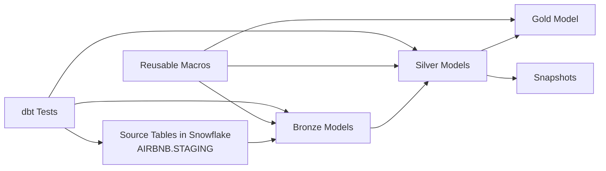

# Snowflake dbt Project

A dbt project for Snowflake that transforms Airbnb-style source data into a clean analytics model using a layered ELT approach. The project demonstrates bronze, silver, and gold transformations, incremental loading, Jinja macros, snapshot-based historical tracking, and source testing.

## Overview

This project is designed to take raw staging data from the `AIRBNB` Snowflake database and turn it into a reporting-ready analytical layer. It follows a medallion architecture:

- Bronze: ingest and lightly structure raw data
- Silver: clean, enrich, and standardize records
- Gold: build an analytical table for reporting and dashboard use
- Snapshots: track historical changes for dimension-like entities

The project uses:
- dbt
- Snowflake
- Jinja macros
- Incremental models
- dbt snapshots
- dbt tests

---

## Architecture



---

## Project Structure

```text
aws_dbt_snowflake_proj/
├── analyses/
├── macros/
│   ├── generate_schema_name.sql
│   ├── multiply.sql
│   ├── tag.sql
│   └── trimmer.sql
├── models/
│   ├── bronze/
│   │   ├── bronze_bookings.sql
│   │   ├── bronze_hosts.sql
│   │   └── bronze_listings.sql
│   ├── gold/
│   │   └── obt.sql
│   ├── silver/
│   │   ├── silver_bookings.sql
│   │   ├── silver_hosts.sql
│   │   └── silver_listings.sql
│   ├── properties.yml
│   └── sources/
│       └── sources.yml
├── snapshots/
│   ├── dim_bookings.yml
│   ├── dim_hosts.yml
│   └── dim_listings.yml
├── tests/
│   └── source_tests.sql
├── dbt_project.yml
├── profiles.yml
├── README.md
├── .gitignore
├── .user.yml
├── logs/
├── seeds/
├── target/
├── dbt_packages/
└── .gitignore
```

---

## Source Data

The project reads from Snowflake staging tables:

- Database: `AIRBNB`
- Schema: `STAGING`
- Tables:
  - `listings`
  - `bookings`
  - `hosts`

These sources are declared in `models/sources/sources.yml`.

Example source configuration:

```yaml
sources:
  - name: STAGING
    database: AIRBNB
    schema: STAGING
    tables:
      - name: listings
      - name: bookings
      - name: hosts
```

---

## Bronze Layer

The bronze models bring staging data into a cleaner dbt-managed structure.

Files:
- `models/bronze/bronze_bookings.sql`
- `models/bronze/bronze_hosts.sql`
- `models/bronze/bronze_listings.sql`

These models are configured as incremental tables, allowing repeated runs to process only new or changed records.

Example pattern:

```sql
{{ config(materialized='incremental') }}

SELECT * FROM {{ source('STAGING', 'bookings') }}


WHERE CREATED_AT > (SELECT COALESCE(MAX(CREATED_AT), '1900-01-01') FROM {{ this }})

```

---

## Silver Layer

The silver layer adds transformations and business logic.

### `silver_bookings.sql`
This model builds the booking fact-like dataset and uses `BOOKING_ID` as the unique key.

It calculates a total value using a reusable macro and reads from the bronze bookings model.

```sql
{{ config(materialized='incremental',
   unique_key='BOOKING_ID'
)}}

SELECT 
    BOOKING_ID,
    LISTING_ID,
    BOOKING_DATE,
    {{ multiply('NIGHTS_BOOKED','BOOKING_AMOUNT', 2) }} + CLEANING_FEE + SERVICE_FEE AS TOTAL_AMOUNT,
    BOOKING_STATUS,
    CREATED_AT
FROM {{ ref('bronze_bookings') }}
```

### `silver_hosts.sql`
This model cleans the host records and assigns rating labels such as:
- Very Good
- Good
- Average
- Poor

### `silver_listings.sql`
This model standardizes listing attributes and adds a price tier label using the `tag` macro.

---

## Gold Layer

### `models/gold/obt.sql`
The gold layer creates a One Big Table (OBT) joining the key silver models:

- `silver_bookings`
- `silver_listings`
- `silver_hosts`

This produces one wide analytical table for dashboards and downstream reporting.

Example structure:

```sql
{% set configs=[
    {
        "table": "AIRBNB.SILVER.SILVER_BOOKINGS",
        "columns":"SILVER_bookings.*",
        "alias":"SILVER_bookings",
    },
    {
        "table":"AIRBNB.SILVER.SILVER_listings",
        "columns":"SILVER_listings.HOST_ID, SILVER_listings.PROPERTY_TYPE, SILVER_listings.ROOM_TYPE, SILVER_listings.CITY, SILVER_listings.COUNTRY, SILVER_listings.ACCOMMODATES, SILVER_listings.BEDROOMS, SILVER_listings.BATHROOMS, SILVER_listings.PRICE_PER_NIGHT, silver_listings.PRICE_PER_NIGHT_TAG, silver_listings.CREATED_AT AS LISTINGS_CREATED_AT",
        "alias":"SILVER_listings",
        "join_condition":"SILVER_bookings.LISTING_ID = SILVER_listings.LISTING_ID"
    },
    {
        "table":"AIRBNB.SILVER.SILVER_hosts",
        "columns":"SILVER_hosts.HOST_NAME, SILVER_hosts.HOST_SINCE, silver_hosts.RESPONSE_RATE_TAG, SILVER_hosts.CREATED_AT AS HOSTS_CREATED_AT",
        "alias":"SILVER_hosts",
        "join_condition":"SILVER_listings.HOST_ID = SILVER_hosts.HOST_ID"
    }
]
%}

SELECT
    
        {{ config['columns'] }},
    
FROM
    
    
        {{ config['table']}} AS {{ config['alias'] }}
    
       LEFT JOIN {{ config['table']}} AS {{ config['alias'] }} ON {{ config['join_condition'] }}
    
    
```

---

## Snapshots

The project includes historical snapshot definitions for dimension-like data:

- `snapshots/dim_bookings.yml`
- `snapshots/dim_hosts.yml`
- `snapshots/dim_listings.yml`

These snapshots use timestamp-based tracking and maintain a historical record for slowly changing dimension data.

Example:

```yaml
snapshots:
  - name: dim_bookings
    relation: ref('bookings')
    config:
      schema: gold
      database: AIRBNB
      unique_key: BOOKING_ID
      strategy: timestamp
      updated_at: CREATED_AT
      dbt_valid_to_current: "to_date('9999-12-31')"
```

---

## Macros

The project contains reusable Jinja macros for common SQL logic.

### `generate_schema_name.sql`
Customizes the schema naming process.

```sql


    
    

        {{ default_schema }}

    

        {{ custom_schema_name | trim }}

    


```

### `multiply.sql`
Multiplies two values and rounds them to a chosen precision.

```sql

    ROUND({{x}} * {{y}}, {{precision}})

```

### `tag.sql`
Creates conditional categorization logic.

```sql

   CASE
    WHEN {{ col }} < 100 THEN 'LOW'
    WHEN {{ col }} >= 100 AND {{ col }} < 200 THEN 'MEDIUM'
    ELSE 'HIGH'
    END

```

### `trimmer.sql`
Trims and uppercases a column value.

```sql

    {{ column_name | trim | upper }}

```

---

## Testing

The project includes a source test in `tests/source_tests.sql`.

```sql
{{ config( severity='Warn') }}

SELECT
1
FROM {{ source('STAGING', 'bookings') }}
WHERE BOOKING_AMOUNT < 200
```

This is a lightweight validation to flag data quality issues without failing the whole pipeline.

---

## dbt Config

The main project settings are defined in `dbt_project.yml`.

```yaml
name: 'aws_dbt_snowflake_proj'
version: '1.0.0'

profile: 'aws_dbt_snowflake_proj'

model-paths: ["models"]
analysis-paths: ["analyses"]
test-paths: ["tests"]
seed-paths: ["seeds"]
macro-paths: ["macros"]
snapshot-paths: ["snapshots"]

clean-targets:
  - "target"
  - "dbt_packages"

models:
  aws_dbt_snowflake_proj:
    bronze:
      +materialized: table
      +schema: bronze
    silver:
      +materialized: table
      +schema: silver
    gold:
      +materialized: table
      +schema: gold
      ephemeral:
        +materialized: ephemeral
```

---

## Snowflake Profile

The project connection is configured in `profiles.yml`.

```yaml
aws_dbt_snowflake_proj:
  outputs:
    dev:
      account: ESUELRX-W*****
      database: AIRBNB
      password: ************
      role: ACCOUNTADMIN
      schema: dbt_schema
      threads: 1
      type: snowflake
      user: Sam
      warehouse: COMPUTE_WH
  target: dev
```

---

## Typical dbt Commands

```bash
dbt deps
dbt run
dbt test
dbt snapshot
dbt build
```

Recommended order:
1. Load raw data to Snowflake
2. Run bronze models
3. Run silver transformations
4. Build the gold layer
5. Create snapshots for history tracking
6. Validate with dbt tests

---

## Key Design Principles

This project demonstrates several important dbt patterns:

- layered modeling
- reusable SQL via macros
- incremental model design
- data quality testing
- historical tracking through snapshots
- end-to-end analytics pipeline organization

---

## Use Cases

This project is well-suited for:
- booking analysis
- host performance reporting
- listing performance analysis
- analytics learning and portfolio projects
- ELT pipeline demonstration in Snowflake

---

## Summary

This project is a practical example of a small but complete analytics engineering setup in dbt. It shows how to organize a warehouse transformation project, clean and enrich source data, build gold-layer reporting tables, and keep historical records through snapshots.

---


